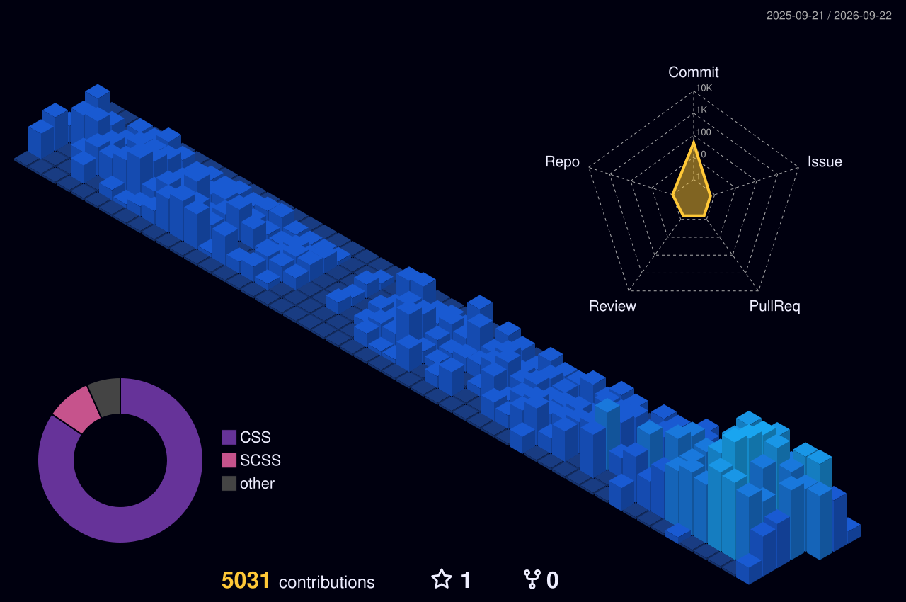

<h1 align="center">Hi 👋, I'm Greg Yang</h1>

  Ruby on Rails developer from Taipei 🇹🇼

  <a href="https://gregning.github.io">Website</a> ·
  <a href="mailto:GregJieNing@gmail.com">Email</a> ·
  <a href="https://github.com/GregNing">GitHub</a>

## About me

I enjoy building practical web applications and learning by turning ideas into working products.

- 💎 Ruby and Ruby on Rails
- 🧰 Full-stack web development
- 📍 Taipei, Taiwan

## GitHub activity

  Explore my latest work, repositories, and contribution history directly on GitHub:

  <a href="https://github.com/GregNing">Profile</a> ·
  <a href="https://github.com/GregNing?tab=repositories">Repositories</a> ·
  <a href="https://github.com/GregNing?tab=overview">Contributions</a>

## Contribution snake

  <picture>
    <source media="(prefers-color-scheme: dark)" srcset="https://raw.githubusercontent.com/GregNing/GregNing/output/github-contribution-grid-snake-dark.svg" />
    
  </picture>

## 3D contribution calendar

  

